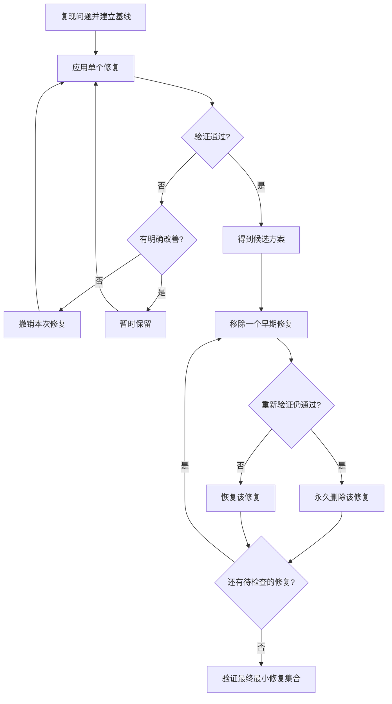

# PROBLEM_FIXING

> 修复 Bug 或问题时，宿主 Agent 按本流程找到**最小、必要、可验证**的修复，而不是保留所有曾经尝试过的修改。本文件只定义仓库稳定合同；不覆盖用户已有修改。

## 1. 核心规则

1. 修复前先复现问题，确认验证基线。
2. 每次修改只验证一个明确假设，并保持可撤销。
3. 验证失败且没有明确改善时，撤销本次修改。
4. 验证失败但解决了必要的子问题时，可暂时保留。
5. 首次验证成功后，结果仅视为候选方案。
6. 逐个移除早期试探性修改并重新验证；依赖不明确时，测试必要的修改组合。
7. 最终只保留最小通过修改集合。
8. 不得撤销、覆盖或混入用户已有修改。
9. 完成前，必须在最终代码上重新运行验证并检查最终 diff。

## 2. 完成前检查

- [ ] 原始问题是否已复现确认，并在最终代码上重新验证通过？
- [ ] 无效、冗余和调试性修改是否已删除？
- [ ] 每个保留修改是否有明确的必要性依据？
- [ ] 是否在最终代码上重新运行全部适用验证？
- [ ] 最终 diff 是否只包含本次问题所需修改？

## 3. 完成条件

最终代码上重新运行验证通过，且上述检查全部通过后，问题修复才算完成。
