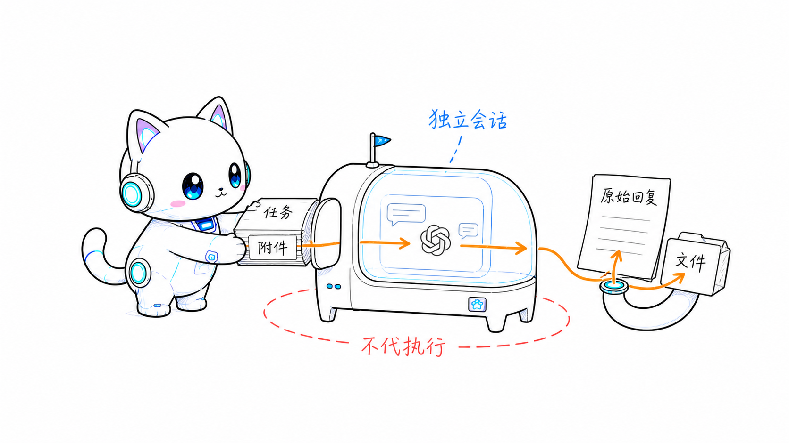
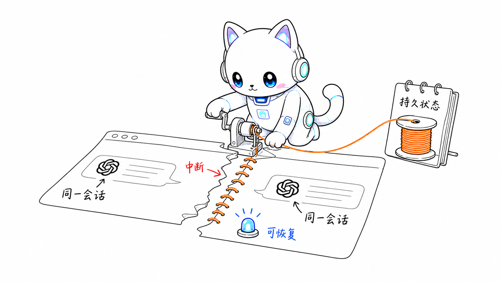

# ChatGPT Pro Collab

ChatGPT Pro Collab 是一个 Agent Skill，让本地 Agent 通过 ChatGPT Pro Web 建立独立、可恢复的协作任务。你决定发送什么 prompt 和附件；Collab 负责浏览器会话、同一 conversation 的多轮沟通、原始回复与文件保存，以及中断后的恢复。

它不会扫描仓库、替你执行 Pro 的建议，也不会提交、合并或发布代码。



## 适合什么场景

- 把一个明确任务交给 ChatGPT Pro 深度处理，并把结果交回本地 Agent 验证。
- 在同一个 conversation 中持续追问，不重复背景说明。
- 显式上传少量文件，或把大量文件打包后作为单个附件发送。
- 等待长时间生成，同时保留 `pending` 状态，稍后继续捕获。
- 保存回复里的 `sandbox:` 文件，并保留 prompt、附件路径、页面证据和操作记录。
- 浏览器关闭、命令中断或提交结果不明确时，从持久状态安全恢复。

## 快速开始

运行环境需要 Node.js `>=22.19.0`、npm/npx、Chrome，以及可交互登录的 ChatGPT Pro 账号。以下命令中的 `<skill-directory>` 是已加载 Skill 的绝对路径；运行时保持宿主项目为当前目录。

### 1. 保存登录状态

首次使用执行一次：

```sh
node "<skill-directory>/scripts/collab.ts" setup
```

Collab 会打开独立浏览器等待登录，验证成功后保存共享认证源。它不会读取或覆盖 Chrome 的日常用户目录。

### 2. 创建任务

为本次协作生成一个稳定的 UUID v4：

```sh
node "<skill-directory>/scripts/collab.ts" start <taskId>
```

每个 task 使用独立的 Playwright session。`start` 只准备固定 Project、GPT-5.6 Sol、Power 5/5 的空白 composer，不会发送消息。

### 3. 发送 prompt 和附件

```sh
node "<skill-directory>/scripts/collab.ts" send <taskId> <promptPath> [attachmentPath ...]
```

`send` 立即返回 `turnId`。附件只来自命令显式传入的路径；Collab 不会自行扫描项目。

### 4. 等待结果

```sh
node "<skill-directory>/scripts/collab.ts" wait <taskId> <turnId> <observationWindowMs> <captureTimeoutMs>
```

完成时返回：

- `responsePath`：未经改写的原始回复。
- `artifactPaths`：按回复顺序保存的 `sandbox:` 文件。

观察窗口到期时返回 `pending`，不会停止 ChatGPT 的生成。之后可以对同一个 `turnId` 再次执行 `wait`。

## 多轮、恢复与收尾

同一轮完成后，再次执行 `send` 和 `wait` 即可继续原 conversation。新 task 的首条消息包含固定协作合同；后续轮次沿用已有上下文，不重复该合同。



先用 `status` 查看持久状态与唯一安全的 `nextAction`：

```sh
node "<skill-directory>/scripts/collab.ts" status <taskId>
node "<skill-directory>/scripts/collab.ts" recover <taskId>
```

常用操作：

| 目的                             | 命令                                                               |
| -------------------------------- | ------------------------------------------------------------------ |
| 暂停本地浏览器，保留可恢复任务   | `close <taskId>`                                                   |
| 恢复关闭或丢失的 task session    | `status <taskId>`，再按 `nextAction` 执行 `recover <taskId>`       |
| 归档 Web conversation            | `archive <taskId>`                                                 |
| 明确提交成功                     | `resolve-submission <taskId> <turnId> submitted <conversationUrl>` |
| 明确没有提交                     | `resolve-submission <taskId> <turnId> not-submitted`               |
| 明确回复已失败或永久无法完成捕获 | `resolve-turn <taskId> <turnId> failed`                            |

`resolve-submission` 和 `resolve-turn` 只用于真实历史事实无法自动判定时；不要把超时或猜测当作人工裁决。

## 输入与等待约束

- Prompt 文件必须是有效 UTF-8，且全文首尾不能有空白，包括文件末尾换行。
- Collab 不会 trim 或改写 prompt；不满足逐字证明条件时会在发送前拒绝。
- 同一 `wait` 内若连续 300000ms 未捕获，Collab 会 reload 当前 conversation 重新水合页面，但不会终止生成或改变 turn 状态。
- 捕获超时后，可以为同一个 turn 提供新的 `captureTimeoutMs` 继续。
- 普通 `https:` 链接不会下载；只有回复中的 `sandbox:` 文件进入 artifact 捕获。

## 本地数据

认证源、SQLite 协调状态、prompt 副本、回复和 artifact 保存在：

```text
~/.local/chatgpt-pro-collab/
```

审计记录只保存显式附件的绝对路径，不复制附件正文。每个 task、turn 和 artifact 都有独立目录与持久身份。

## 在源码仓库中运行

安装依赖后，可以用 package script 替代完整路径：

```sh
pnpm install
pnpm collab -- setup
pnpm collab -- start <taskId>
pnpm collab -- send <taskId> <promptPath> [attachmentPath ...]
pnpm collab -- wait <taskId> <turnId> <observationWindowMs> <captureTimeoutMs>
pnpm collab -- status <taskId>
pnpm collab -- recover <taskId>
pnpm collab -- resolve-submission <taskId> <turnId> submitted <conversationUrl>
pnpm collab -- resolve-submission <taskId> <turnId> not-submitted
pnpm collab -- resolve-turn <taskId> <turnId> failed
pnpm collab -- archive <taskId>
pnpm collab -- close <taskId>
```

完整产品行为、状态合同和验收条件见 [浏览器协作 Spec](docs/specs/2026-08-03-chatgpt-pro-browser-collaboration.md)。
