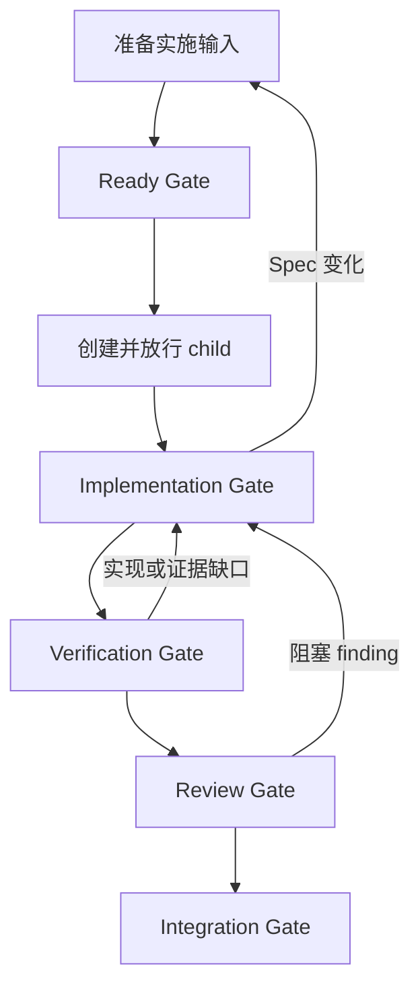

# WORKFLOW

> 用户明确要求按 `docs/specs/<规格文件>.md` 实现并提交代码时，宿主 Agent 使用 `execute-spec-workflow` Skill 协调本流程。本文件只定义仓库稳定合同；阶段执行细节由该 Skill 及其 references 承载。

## 1. 角色与权威

- 宿主 Agent 负责准备、编排、等待、Review 协调和最终集成，不直接实现或修复代码。
- 原 implementation terminal 负责实现、修复、验证、提交和任务账本证据回写。
- 首次 Review 使用新的只读 reviewer terminal；同一 finding 及其修复影响由原 reviewer terminal 跟踪至关闭。只有独立新问题才建立新的 Review 上下文。
- 当前 Spec 是产品行为和验收的权威来源；对应 `docs/execution/*.tasks.json` 是实施任务身份、依赖、状态和证据的权威来源。
- `execute-spec-workflow` Skill 负责状态检测和阶段路由，不复制其他 Skill 已覆盖的操作指南。

## 2. 稳定标识

| 标识        | 定义                                    | 持久位置                 |
| ----------- | --------------------------------------- | ------------------------ |
| `BASE_SHA`  | 本次实施周期开始前的完整 commit SHA     | 任务账本                 |
| `READY_SHA` | 包含全部实施输入的 child 创建起点       | 本次编排上下文和最终报告 |
| `HEAD_SHA`  | 当前 implementation branch 的被审查提交 | Git 与 Review 上下文     |

`READY_SHA` 不写入产生该 SHA 的提交。首次派发要求 child `HEAD` 等于 `READY_SHA`；恢复已有 child 时要求 `READY_SHA` 是当前 `HEAD` 的祖先。

## 3. Gate 合同

| Gate           | 进入条件                    | 放行条件                                                 |
| -------------- | --------------------------- | -------------------------------------------------------- |
| Ready          | Spec 已成形，实施目标可拆分 | 任务账本与 Spec 一致；实施输入已提交；`READY_SHA` 已记录 |
| Child          | Ready Gate 通过             | Child 起点正确、worktree clean、`check --ready` 通过     |
| Implementation | Child Gate 通过             | 当前 IMP 的实现、相关检查、commit 和证据已取得           |
| Verification   | 全部实现完成                | 必需 VER 与适用检查通过；委派证据已回写；外部资源已归类  |
| Review         | Verification Gate 通过      | 所有阻塞 finding 已由对应 reviewer 关闭                  |
| Integration    | Review Gate 通过            | `check --final` 通过；已验收分支已集成；非预期资源已清理 |

任一 Gate 未通过时停在当前阶段，或返回表中能够解除缺口的前序阶段。禁止跨过 Gate、跳过有效测试、伪造证据或把未运行验证报告为通过。

## 4. 交付前检查

- [ ] `BASE_SHA`、`READY_SHA`、implementation worktree、branch、terminal 和 Review 上下文是否可定位？
- [ ] Ready、Child、Implementation、Verification、Review 和 Integration Gate 是否均有当前证据？
- [ ] 任务账本是否与当前 Spec 一致，并真实记录 IMP 状态、依赖、commit 和证据？
- [ ] 所有必需验证是否在最后一次相关修改后通过？
- [ ] 所有阻塞 finding 是否已由对应 reviewer 明确关闭？
- [ ] 主工作区和 implementation worktree 是否没有非预期残留？
- [ ] 任务完成前是否已完成自审？
- [ ] 未验证项和剩余风险是否已明确记录？

## 5. 最终报告

报告 `BASE_SHA`、`READY_SHA`、implementation worktree、branch 和 `HEAD_SHA`，列出 `IMP → BEH/VER → commit` 映射、各 Gate 证据、Code Review 结论、外部资源收口、集成结果、未验证项和剩余风险。
