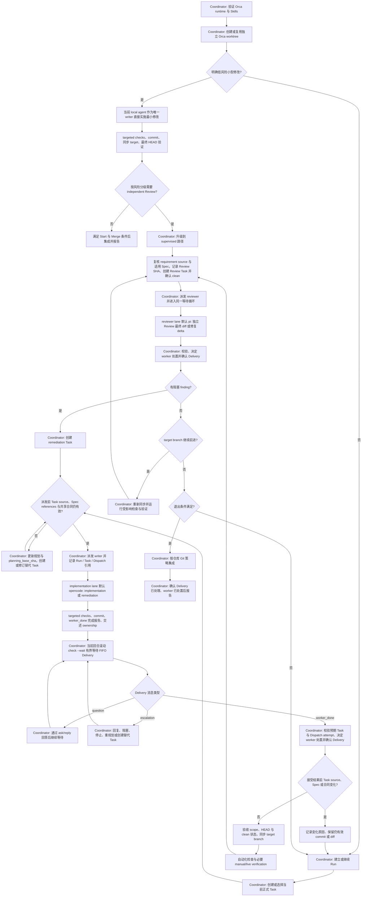

# WORKFLOW

本文件是仓库唯一的开发流程合同：以 Orca Workspace、`orca-cli` 与 Orca Orchestrator 为核心。标准和高风险变更执行本文件完整路径，其中第 3 至 8 节是实施主线；低风险小型变更可按第 4 节简化，但不得省略适用的角色与权威边界、Start 条件和 Merge 条件。Orca 操作命令以本机 `orca-cli` 与 `orchestration` Skill 为准，本文件不复制其手册。

## 1. 角色与权威边界

- **Coordinator**：local coordinating session。使用 Orca Orchestrator 建立并监督 Run、Task 与 Dispatch，维护 writer ownership，接收并处理 worker 结果，处理 Spec 变化，执行 target branch 同步、最终验证、Review 调度、集成与报告。Context compact 或接手后，先读本地 checkpoint，再以 Orca runtime、Git、requirement source 和适用 Spec 校准。
- **Implementation writer**：Orca supervised worker，默认 Agent 为 `opencode`；承担 implementation 和 remediation，只写入 Task 声明的 write scope。
- **Independent reviewer**：Orca supervised worker，默认 Agent 为 `pi`；Review 指定 SHA 区间并返回 findings，不修改文件或 Git 历史。
- **Orca Orchestrator**：为 Coordinator 提供 Run、Task、Dispatch、Message 和可选 decision gate 的运行时生命周期及任务状态。其 decision gate 只用于运行时阻塞问题，不是仓库级第三个放行 Gate。

Implementation 和 Review 是被调度的 worker lane，无需另行启动固定的 Coordinator worker。默认 Agent 不可用或有明确不适配原因时，选择其他已配置 Agent，保持相同角色合同，并在最终报告中记录实际 Agent 与原因。

## 2. 权威来源与 runtime 边界

- Requirement source 定义当前任务目标。
- 适用 Spec（`docs/specs/*.md`）是产品行为、约束和验收条件的权威来源。
- Git branch、commit 和最终 diff 是实现状态的权威来源。
- 自动化检查和 Task 要求的 manual/live verification 证明行为；标准和高风险变更使用独立 Review。
- Orca runtime 运行信息只存在于 runtime，不提交为仓库任务账本。
- 长期仓库资产只包括正常工程内容；当前执行状态留在 Orca runtime，必要的恢复摘要只写入 Git-ignored 的 worktree 本地文件（第 9 节）。

## 3. Worktree 与 writer ownership

- Orca-managed worktree 是开发工作的隔离边界；`orca-cli` 管理 worktree、terminal 和轻量进度 checkpoint。
- 同一文件或共享状态范围同时只有一个 writer；只读调查可并行。
- 实施在独立 task worktree 上进行，不在用户主工作区直接实施。
- Coordinator 仅在相关 writer 已交还 ownership 且不存在重叠 writer 时，处理机械冲突、集成胶水或小型修复。
- 低风险直接路径没有派发 implementation worker 时，当前 local agent 必须显式声明对该任务范围的唯一 write ownership；其产生的任何修改都必须提交、复验，并纳入适用的 Review 范围。

## 4. Orca Task 与风险分级

- 每个 Orca Task 必须明确 requirement source，例如 handoff、issue、ADR 或产品 Spec。
- 只有受产品 Spec 管辖的 Task 才使用带文件路径的 `spec_refs`（如 `docs/specs/<file>.md#BEH-001`）；非产品行为 Task 保持 `spec_refs` 为空，不得为追踪方便伪造 `BEH-*` 或 `VER-*`。`BEH-*` 与 `VER-*` 只在所属 Spec 内定位，不是仓库全局裸 ID。
- Implementation Task spec 至少包含：`role`、`objective`、`planning_base_sha`、`source_refs`、`spec_refs`、`acceptance`、`write_scope`、`depends_on` 与 `required_checks`。Review Task 使用 `role: review`，引用 `review_base_sha`、`reviewed_head_sha` 和要检查的验收条件。
- 这些字段属于 Orca Task spec，不写入仓库账本，也不复制到 checkpoint 形成第二套任务图。`objective` 与 `acceptance` 是当前 Task 的语义快照；`planning_base_sha` 只锚定 Git 已跟踪内容；requirement source 未被 Git 跟踪时，直接比较当前 source 内容与该语义快照。
- 风险分级：标准和高风险变更走完整 implementation + Review 路径；明确的低风险小型变更可由单一 Agent 完成，省略 dispatched writer 或 independent reviewer，但不得省略 Start 与 Merge 条件，也不得跳过适用的验证要求；按风险分级需要独立 Review 时，升级到 supervised 路径（第 6、7 节），由 Coordinator 进入原生等待循环。

## 5. Spec 增量处理

派发 implementation 或 remediation 前，以及接受对应 Dispatch attempt 的 worker 结果前，比较 Task 的 `planning_base_sha`、`source_refs`、适用 `spec_refs`、共享合同与当前内容。处理规则：

- 没有语义变化，或只有拼写、排版和说明优化：继续当前任务。
- 变化与当前 source/spec references、共享合同和依赖闭包无关：当前任务继续，为新变化建立独立 Task。
- 变化影响当前目标、行为、公共契约、权限、状态模型或验证规则：结算受影响 Dispatch，使用 Orca 支持的 Task status/result 记录原因；产品 Spec 变化可记录 `spec_changed`，再创建替代 Task。
- 仍符合新版 requirement/Spec 的现有 commit 或 diff 可作为替代 Task 输入，不机械推倒重做。

Coordinator 只接受同时满足以下条件的完成结果：`taskId` 对应当前 Task；`dispatchId` 对应该 Task 的对应 Dispatch attempt（有效 `worker_done` 后 runtime 状态可以已离开 active/dispatched 并进入终态，不假定 outcome 与具体状态名称的映射，应结合 Message、Task/Dispatch 当前 runtime 状态与预期 attempt 判断）；报告的 final SHA 可定位；修改文件属于声明的 write scope（或越界原因已被 Coordinator 接受）；writer 已交还相关 ownership。stale、rejected 或重复但不属于当前预期 attempt 的结果不得成为候选依据。

## 6. 实现、提交、同步与验证

1. Coordinator 在独立 worktree 完成 inventory，通过 Orchestrator 建立 Run 和 implementation Task，并记录 target branch、target SHA、`planning_base_sha`、requirement source、适用 Spec references、write scope 与验收条件。
2. 派发前按第 5 节校验；仍有效时按本机 Skill 派发默认 `opencode` writer；已变化时先更新规划和替代 Task。派发成功后 Coordinator 按本节进入原生等待循环，不从命名、branch 或本地上下文推断运行时目标。
3. Implementation writer 在声明的 write scope 内实施，运行 targeted checks，把改动提交到 task branch，通过当前 Dispatch 的完成消息报告 `taskId`、`dispatchId`、final SHA、修改文件、检查结果和剩余问题，同时交还 write ownership。worker_done 等正式事件经 Run inbox 的 FIFO Delivery 投递，由 Coordinator 按本节原生等待循环消费。允许多个有意义的 commit，不强制 squash。
4. Coordinator 在接受结果前再次按第 5 节比较，并读取 Orca Task/Dispatch、Git HEAD 与 worktree 状态；只接受匹配预期 Task 与对应 Dispatch attempt 的结果（有效 `worker_done` 后 runtime 状态可以已离开 active/dispatched），确认 commit 属于声明 scope、final SHA 可定位、没有重叠 writer，且 worktree clean。
5. Coordinator 同步当前 target branch。机械且可控的冲突可在没有重叠 writer 时直接解决；超出该边界的冲突建立 remediation Task，交给 implementation lane。该 Task 同样遵循本节的 source/Spec、scope、commit、完成报告与 ownership 合同。冲突处理完成后提交并再次确认 clean。
6. Coordinator 将同步所用的 target SHA 记录为 `REVIEW_BASE_SHA`，然后在同步后的 HEAD 运行 `pnpm check` 和 `git diff --check "$REVIEW_BASE_SHA"...HEAD`，并执行 Task、Spec 或风险分级要求的 manual/live verification。所有结果绑定当前 HEAD；无法执行的项目记录具体原因和剩余风险。

### Coordinator 原生等待循环

Implementation、remediation 与 review 三条 worker lane 共用同一个原生监督循环：Coordinator 派发成功后不结束当前模型回合，在当前回合内滚动执行有界 `check --wait` 消费 Run inbox 的 FIFO Delivery；不依赖 child 发送 wake signal、terminal input、terminal delivery 或后台 waiter。命令、超时与恢复细节以版本匹配的 `orchestration` Skill 和运行时回执为准，本节只规定仓库级不变序列。Coordinator 指监督方 session，worker 指被派发的 supervised worker，不是 Git branch 关系。

1. 派发成功后记录必要的 Run / Task / Dispatch 引用（第 9 节 checkpoint），然后在当前模型回合内执行有界 `check --wait`，等待 `worker_done`、`escalation`、`question`；不得用 sleep、周期 terminal read 或后台 waiter 替代。
2. `check --wait` 返回一个有界 FIFO Delivery：处理该 Delivery 的全部 Message；类型过滤只决定何时返回，不缩减该 Delivery 内必须处理的消息。
3. `question` 使用版本匹配的 Orchestration ask/reply 路径回答，不得通过 terminal send 向 supervised worker 传递正式业务答复；ask timeout 或 disconnect 后按当前 Skill 对原 Message ID 执行 resume/recovery，不重复创建同一问题。
4. `escalation` 根据内容回复、阻塞、停止、重规划或创建 replacement/remediation Task。
5. `worker_done` 先校验该 Message 属于预期 Task 与对应 Dispatch attempt（排除 stale、rejected 或错误 attempt），结合 Task/Dispatch 当前 runtime 状态判断有效性，再执行仓库候选验证（第 5 节）。有效结果由 Orca runtime 按合同自动结算 Task 与 Dispatch，不追加手动结算；无效结果不得作为候选依据。
6. 每个被接受的 `worker_done` 之后、ack 或再次等待之前，决定该 worker terminal 的归属：同一 agent 有立即 follow-up Task 时按当前 Skill 复用；用户明确要求保留时执行 worker-retain；其余（包括 failed outcome）执行 worker-release。stale、rejected 或错误 attempt 的消息不得触发清理。
7. 完成该 Delivery 的全部副作用后，ack 是事务最后一步；随后若仍有 expected unsettled Dispatch，继续下一次有界 wait。
8. timeout、空结果、heartbeat、可见 terminal 活动或 TUI idle 都不等于完成或失败；只要仍有 expected unsettled Dispatch，就继续等待，除非 runtime 证明 worker 失败、停止或丢失，或用户明确停止。
9. 只有全部 expected Dispatch 已结算且满足 Merge 条件（第 12 节）时，Coordinator 才结束监督循环并进入集成。

规则：

- Coordinator 对最终结果负责，但负责不表示持续观察 worker terminal；进度以 Delivery 事件为准。
- Coordinator 对 worker 的正式回复使用版本匹配的 Orchestration answer/reply/send 路径；terminal input、terminal delivery 或 child signal 不是监督生命周期的恢复机制。
- Runtime 对象和 task worktree 在集成后由 Coordinator 清理（第 8 节）；Run 是 durable 命名空间与 inbox，不执行关闭动作。

## 7. 独立 Review 与 finding 修复

Review 与 remediation lane 的派发、事件接收和 worker 处置遵循第 6 节的 Coordinator 原生等待循环。

1. 派发 Review 前重新读取 requirement source 与适用 Spec；发生相关语义变化时按第 5 节重规划。
2. 将 Review Task 的 `review_base_sha` 设为 `REVIEW_BASE_SHA`，把当前 HEAD 记录为 `reviewed_head_sha`，确认 `HEAD == reviewed_head_sha` 且 `git status --porcelain=v1` 为空。
3. 创建 Review Task 并派发 reviewer lane（默认 `pi`）。默认让 reviewer 读取当前 task worktree 的 `reviewed_head_sha`，不授予 write ownership；若采用独立 review worktree，先确认其 `review_base_sha` 与 `reviewed_head_sha` 和待审分支一致。任务合同至少包含：Review 指定 SHA 区间；不修改文件、不提交；优先检查正确性、回归、缺失检查、流程合同违规与 Orca runtime 状态意外持久化；按严重程度报告带 file/line 的 findings；明确声明是否仍有阻塞 finding。
4. 只接受与 Review Task 预期 Task 和对应 Dispatch attempt 匹配的完成结果（有效 `worker_done` 后 runtime 状态可以已离开 active/dispatched）；接受后再次确认 `HEAD == reviewed_head_sha` 且 worktree clean。此处验证 reviewer 的任务合同，不把 prompt 约束描述成文件系统权限。
5. 自动化检查、`git diff --check` 与必要 manual/live verification 绑定 `reviewed_head_sha`；Reviewer 核对该关系，有具体风险时可运行 targeted check，不强制重复完整套件。
6. 有阻塞 finding：创建 remediation Task，在重新授予单一 writer ownership 后派发 implementation lane。Remediation 遵循第 6 节的 requirement/Spec、scope、commit、完成报告与 ownership 合同；接受结果后重跑受影响检查和最终 `pnpm check`，按需重做 manual/live verification，更新 `reviewed_head_sha`，再由原 reviewer lane Review delta 与受影响上下文。原 reviewer 不可用时，按同一合同选择替代 reviewer 并记录原因。

## 8. Target branch 前进与集成

- Review 接受后重新读取 target SHA：未前进时可以集成；已前进时重新同步并运行受影响检查，同步影响被测范围时重跑 `pnpm check` 与对应 manual/live verification，更新 `REVIEW_BASE_SHA` 与 `reviewed_head_sha`，回到第 7 节。
- 同步产生冲突解决、最终 diff 变化或共享行为变化时，reviewer 扩大到受影响上下文；否则只做同步 delta 的轻量确认，不强制重复完整 Review。
- Coordinator 按仓库 Git 策略集成。集成与报告前确认退出条件（第 12 节 Merge 条件）：所有 expected Task/Dispatch 已进入符合预期的终态；当前绑定 Run 的 Delivery 已完整处理并 ack，没有未 ack Delivery 阻塞 FIFO；每个已确认结算的 worker（包括 failed outcome）已复用、显式保留或释放；没有仍会修改最终候选的 writer 或 active Dispatch。然后清理不再需要的 terminal 和 worktree。Run 作为 durable 命名空间与 inbox 保留，不执行关闭动作。

## 9. Checkpoint 与清理

- 优先用 Orca worktree comment 保存一行进度；需要更多恢复上下文时，在当前 worktree 使用 `.orca-tmp/session-handoff.md`（该目录已被根 `.gitignore` 忽略）。规则落地前只使用 worktree comment。
- checkpoint 只保存 8 个字段：Objective；Worktree / branch / target；Last stable HEAD；Active Task / Dispatch:；Current writer and scope；Last completed action；Next action；Decisions / blockers / unverified items。其中 'Active Task / Dispatch:' 的值只放运行时引用：run=<run-id>；task=<task-id>；dispatch=<dispatch-id>，不新增第九个字段。
- 不保存 heartbeat、等待时长、Message 镜像、terminal transcript、terminal handle、runtime task graph、自定义任务状态、逐任务 evidence 或 finding 状态表；checkpoint 不是 Task ledger 镜像。terminal handle 是运行期路由信息，不是持久身份或恢复合同，需要时从 Orca runtime 重新解析。与现场冲突时，以 Orca runtime、Git、requirement source 和适用 Spec 为准。child worktree 不继承父 worktree 的 ignored 文件，跨 worktree 上下文通过 Orca Task spec 或消息传递。
- 只在 context compact 前、ownership 交接前、关键决策、阻塞或重规划时、重要 Delivery 处理完成或显式恢复校准后更新。若 context 中断发生在 Delivery 处理与 ack 之间，只在现有 `Decisions / blockers / unverified items` 字段记录最小事务摘要：Delivery ID、已处理 Message IDs、已完成 durable side effects 与 ack 状态；恢复时先核对这些副作用，避免重复回复、重复建 Task、重复集成或错误清理，不新增 checkpoint 字段。恢复顺序：读取 handoff 与当前 worktree checkpoint → 读取 Git 与 Orca runtime → 读取 requirement source 与适用 Spec → 修正过期摘要 → 从 Next action 继续。
- 任务结束且不再需要恢复后，删除 `.orca-tmp/session-handoff.md`；`git clean -fdX` 前确认不再需要 checkpoint。

## 10. 最终报告

只列出可证明内容：Orca worktree、branch、initial target SHA、final review base SHA、最终 commit；实际 Agent 及覆盖原因；Run、Task 与 Dispatch 的结算状态；删除与修改文件；检查及对应 HEAD；Review 结论和已修复 finding；现有功能 worktree 状态；未验证项和剩余风险。

## 11. Start 条件

- [ ] Coordinator 已确认目标、范围和验收条件清楚，并承担本次工作的监督与汇总责任。
- [ ] target branch、target SHA、worktree 和 task branch 可定位。
- [ ] worktree clean，或已有修改的负责人和用途已明确。
- [ ] Task 的 requirement source、适用 Spec references、write scope、required checks 和 dependencies 已明确。
- [ ] 没有两个 writer 修改同一文件或共享状态范围。
- [ ] 低风险直接路径：当前 local agent 拥有唯一 write ownership，不派发 worker、不进入等待循环；实施仍满足提交、验证与 target 同步要求。按风险分级需要独立 Review 时，升级到 supervised 路径（第 7 节），创建或绑定 Run 并进入原生等待循环。
- [ ] supervised 路径：Run/Task/Dispatch 可定位，Coordinator 将在当前模型回合执行有界滚动 `check --wait`，直至 expected Dispatch 全部结算。
- [ ] 高风险变化已识别必要的 Spec、manual/live verification 和 Review。

## 12. Merge 条件

- [ ] 所有待 Review 改动已提交，worktree clean。
- [ ] task branch 已同步 Review 所依据的 target SHA；Review 后的 target branch 前进已按第 8 节处理。
- [ ] Coordinator 在最终相关修改后运行的自动化检查通过，结果绑定最终 HEAD。
- [ ] 当前 requirement source 与适用 Spec 仍支持最终实现和验收条件。
- [ ] 必需的 manual/live verification 已完成，或未验证原因已记录。
- [ ] 任务要求的独立 Review 已完成，结论绑定最终 HEAD，阻塞 finding 已关闭。
- [ ] 最终 diff、未验证项和剩余风险已检查并报告。
- [ ] required Dispatch 已完成并被接受，阻塞 question/escalation 已解决，writer ownership 已归还，没有仍会修改最终候选 HEAD 的 active Dispatch。
- [ ] 当前绑定 Run（如有）没有未 ack 的 Delivery 阻塞 FIFO；每个已确认结算的 worker（包括 failed outcome）已复用、显式保留或释放。低风险直接路径不存在 Dispatch 时该条件自然满足。

完成条件：Start 与 Merge 条件全部满足后，由 Coordinator 按第 8 节集成并报告。
