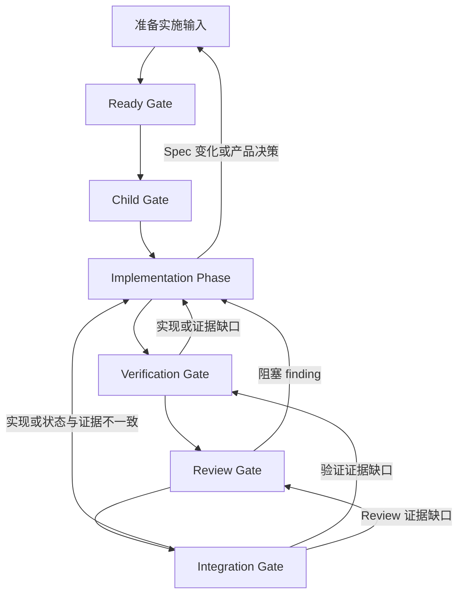

# WORKFLOW

> 用户明确要求按 `docs/specs/<规格文件>.md` 实现并提交代码时，宿主 Agent 使用 `execute-spec-workflow` Skill 协调本流程。本文件只定义仓库稳定合同；阶段执行细节由该 Skill 及其 references 承载。

## 1. 角色与权威

- 宿主 Agent 负责准备、编排、等待、Review 协调和最终集成，不直接实现或修复代码。
- 原 implementation terminal 负责实现、修复、验证、提交和任务账本证据回写。
- 首次 Review 使用新的只读 reviewer terminal；同一 finding 及其修复影响由原 reviewer terminal 跟踪至关闭。只有独立新问题才建立新的 Review 上下文。
- 当前 Spec 是产品行为和验收的权威来源；对应 `docs/execution/*.tasks.json` 是实施任务身份、依赖、状态和证据的权威来源。
- `execute-spec-workflow` Skill 负责状态检测和阶段路由，不复制其他 Skill 已覆盖的操作指南。

## 2. 稳定协作身份

| 身份                    | 合同                                                             |
| ----------------------- | ---------------------------------------------------------------- |
| implementation worktree | 承载已提交实施输入、实现和验证的唯一 child worktree              |
| implementation branch   | 本次实施周期的持久工作身份                                       |
| implementation terminal | implementation branch 的唯一写入者                               |
| Review Task             | 当前 Review 上下文；同一 finding 的修复和复审保持在该上下文      |
| reviewer terminal       | Review Task 的只读审查者；独立新问题才使用新的 reviewer terminal |

Git revision 只用于运行时确认 Reviewer 检查的实现内容与最终集成内容相同，不作为 WORKFLOW 标识或任务账本结构化字段。

## 3. Spike 边界

- 实施过程中出现未知项时，原 implementation terminal 只报告未知项及影响面，不自行创建或执行 Spike，也不修改 Spec 或 ADR。
- 只有宿主明确 dispatch 才执行 Spike；宿主决定进入 Spike 时，按 `create-spike` Skill 创建和执行。
- 一个 Spike 只回答一个有界决策问题，结论为 GO/NO-GO/INCONCLUSIVE；决策问题变化时新建 Spike 文档，不在旧文档追加。
- Spike 结论为 GO 时继续当前实施；NO-GO、INCONCLUSIVE 或需要产品决定时返回准备阶段，停止当前 dispatch。

## 4. Gate 合同

| Gate         | 进入条件                    | 放行条件                                                                                                                       |
| ------------ | --------------------------- | ------------------------------------------------------------------------------------------------------------------------------ |
| Ready        | Spec 已成形，实施目标可拆分 | 任务账本与 Spec 一致；实施输入已提交；实施输入提交后 `check --ready` 已通过一次                                                |
| Child        | Ready Gate 通过             | child 起点包含已提交实施输入；协作身份唯一；worktree clean                                                                     |
| Verification | 全部实现完成                | 必需 VER 与适用检查通过；委派证据已回写；外部资源已归类                                                                        |
| Review       | Verification Gate 通过      | implementation branch 在 Review 期间已冻结；所有阻塞 finding 已由对应 reviewer 关闭                                            |
| Integration  | Review Gate 通过            | 证据语义核对通过；`check --final` 通过；账本收口后实现内容未变化；implementation branch 已 fast-forward 集成；非预期资源已清理 |

Gate 只包括 Ready、Child、Verification、Review 和 Integration。Implementation 是 Child 与 Verification 之间的阶段，不是 Gate；其完成条件为：全部可执行 IMP 已提交到 implementation branch 并取得相关检查和证据，或已到达 decision boundary 并报告。

- 一个 dispatch 连续处理所有可执行 IMP，直到遇到产品决策、Spec 变化、需宿主执行的外部验证、阻塞 finding 或其他明确 decision boundary；禁止为每个 IMP 单独派发。
- 任一 Gate 未通过时停在当前阶段，或返回表中能够解除缺口的前序阶段。禁止跨过 Gate、跳过有效测试、伪造证据或把未运行验证报告为通过。
- Review 期间禁止修改 implementation branch。
- Reviewer 返回后，只允许原 implementation terminal 提交对应任务账本的 Review 结论和状态。
- 其他文件变化、目标分支前进或 rebase 都会使 Review Gate 失效。
- Review Gate 失效后，原 implementation terminal 完成同步和验证，再由原 reviewer terminal 复审。
- Integration Gate 的“证据语义核对”指宿主逐项确认 `evidence.checks` 与 `evidence.reviews` 相关、当前、可定位，且 IMP 状态与证据一致；`check --final` 只校验账本 schema、Spec 摘要、覆盖、依赖、状态和证据字段非空，不判断证据内容是否真实或相关。

## 5. 交付前检查

- [ ] implementation worktree、branch、terminal 和 Review 上下文是否唯一且可定位？
- [ ] Ready、Child、Verification、Review 和 Integration Gate 是否均有当前证据？
- [ ] Implementation 阶段是否完成全部可执行 IMP，并取得相关检查和证据？
- [ ] 任务账本是否与当前 Spec 一致，并真实记录 IMP 状态、依赖和证据？
- [ ] 所有必需验证是否在最后一次相关修改后通过？
- [ ] 所有阻塞 finding 是否已由对应 reviewer 明确关闭？
- [ ] 证据是否逐项核对为相关、当前、可定位，且状态与证据一致？
- [ ] 未知项是否已报告宿主并明确路由（继续 / Spike / 产品决策），且没有未经授权的 Spike、Spec 或 ADR 修改？
- [ ] 主工作区和 implementation worktree 是否没有非预期残留？
- [ ] 任务完成前是否已完成自审？
- [ ] 未验证项和剩余风险是否已明确记录？

## 6. 最终报告

报告 implementation worktree、branch、terminal 和 Review 上下文，列出 `IMP → BEH/VER → evidence` 映射、各 Gate（Ready、Child、Verification、Review、Integration）证据、Code Review 结论、Integration Gate 证据核对结论、Spike 或产品决策结果（如有）、外部资源收口、fast-forward 集成结果、未验证项和剩余风险。
