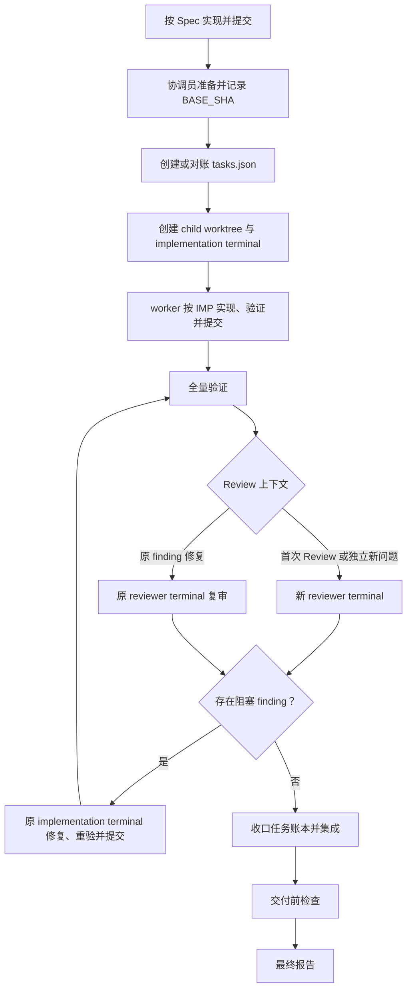

# WORKFLOW

> 用户明确要求按 `docs/specs/<规格文件>.md` 实现并提交代码时，宿主 Agent 作为协调员执行本流程；实现与修复由 Orca 新 child worktree 中的 implementation terminal 完成。

## 1. 准备

- 宿主 Agent 只负责准备、编排、等待、Review 协调和最终集成，不直接实现或修复代码。
- 读取完整 Spec、相关代码、测试和当前工作区改动。
- 记录实现前的 `BASE_SHA`。
- 使用 `plan-spec-implementation` Skill 创建或增量对账 `docs/execution/<spec basename>.tasks.json`，并把 `BASE_SHA` 写入账本。已有账本不得整体重建、重排或复用 `IMP-*`。
- 从仓库根目录运行任务脚本的 `check --ready`；账本与当前 Spec 摘要不一致、BEH/VER 覆盖不完整、依赖有环，或仍有 `blocked`、`invalidated` 任务时不得开始实现。
- 新 child worktree 不继承未提交改动；worker 需要的 Spec、任务账本和其他输入必须先提交。存在重叠改动时停止并报告。
- 规格冲突、产品决定缺失或无法验证时，停止并报告；不得猜测或擅自修改产品行为。

## 2. 编排、任务执行与提交

- 宿主使用 `orchestration` Skill 编排协作，并使用 `orca-cli` Skill 创建新的 child worktree 和 implementation terminal。
- Implementation worker 按账本中的 `dependsOn` 选择可执行的 `IMP-*`。运行时计划只镜像当前任务，任务身份、状态和依赖以账本为准。
- 每个 `IMP-*` 是可独立实现、验证、提交和返工的最小行为切片；不要求 BEH、IMP 与 commit 一一对应。
- 每个提交执行：实现 → 相关验证 → 自查 diff → 修复 → 复验 → commit。
- 提交后在对应 IMP 中记录 commit 和已取得的验证证据。实现、验证或 Review 尚未齐全时不得标记 `done`。
- Spec 在执行中发生变化时，worker 停止受影响任务并报告宿主；重新对账并通过 `check --ready` 后才能继续。
- Worker 完成后发送一次 `worker_done`；宿主等待并处理结果，不接管实现。
- 禁止跳过有效测试。

## 3. 全量验证

- Implementation worker 完成全部实现后，运行所有必需 `VER-*` 和 `AGENTS.md` 规定的适用检查。
- 验证失败时，由原 implementation terminal 修复、重验并 commit；同步更新受影响 IMP 的状态与证据。
- 未运行的验证不得报告为通过。

## 4. Code Review

- 首次 Review 使用 `orchestration` Skill 在 implementation worktree 建立新的根 Review Task 和只读 reviewer terminal；该 Task 的 `taskId` 标识本次 Review 上下文。Reviewer 使用 `open-code-review-delegate` Skill 审查当前 Spec 和 `BASE_SHA..HEAD_SHA`，禁止宿主 Agent 自审或传入自己的 Review 结论。
- 存在阻塞 finding 时，宿主把 finding 交回原 implementation terminal 修复、重验并 commit，再通过 `orchestration` Skill 创建根 Review Task 的复审子 Task，复用原 reviewer terminal。宿主不得直接修复 finding，也不得仅因 HEAD、Task、Dispatch 或复审轮次变化而新建 terminal。
- 原 reviewer terminal 负责跟踪该 finding 及其修复引起的问题或证据缺口，直至明确关闭。只有 reviewer 发现与原 finding 根因无关、也不是其修复影响或证据缺口的独立新问题时，才为该问题建立新的根 Review Task 和 reviewer terminal。
- Review 完成后，宿主把 Review Task、reviewer terminal 和结论交回原 implementation terminal；worker 只更新任务状态和证据，并运行 `check --final`。宿主随后集成已验收的 worker branch；发生冲突时仍交回原 implementation terminal 处理。

## 5. 交付前检查

全部勾选后才能交付：

- [ ] 宿主 Agent 是否只承担协调职责，没有直接实现或修复代码？
- [ ] 是否使用 `orchestration` 和 `orca-cli` Skill 创建新的 child worktree 和 implementation terminal？
- [ ] 当前 Spec 中的 `BEH-*`、`VER-*` 和产品边界是否均已覆盖？
- [ ] 任务账本是否与当前 Spec 摘要一致，并真实记录 `BASE_SHA`、IMP 状态、依赖和证据？
- [ ] 所有必需验证是否在最后一次相关代码修改后通过？
- [ ] 每个 commit 是否目的单一且没有混入无关改动？
- [ ] 首次 Review 是否使用新的 reviewer terminal，所有阻塞 finding 是否由原 implementation terminal 修复并由原 reviewer terminal 复审关闭？
- [ ] 是否仅为独立新问题建立新的 reviewer terminal？
- [ ] 任务脚本的 `check --final` 是否在账本收口后通过？
- [ ] 已验收的 worker branch 是否已经集成？
- [ ] 未验证项和剩余风险是否已经明确记录？

## 6. 最终报告

报告 implementation worktree、branch 和 HEAD，列出 `IMP → BEH/VER → commit` 映射、验证结果、Code Review 结论、集成结果、未验证项和剩余风险。
