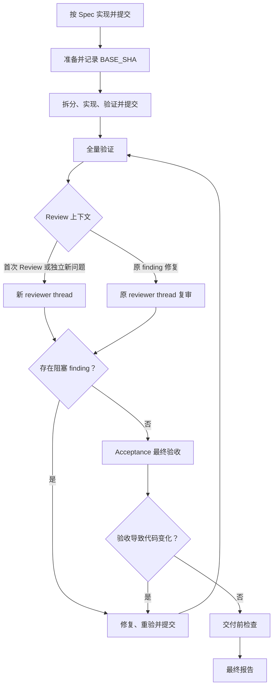

# WORKFLOW

> 用户明确要求按 `docs/specs/<规格文件>.md` 实现并提交代码时，执行本流程。

## 1. 准备

- 读取完整 Spec、相关代码、测试和当前工作区改动。
- 使用 `acceptance` Skill：有 verify plan 时读取计划；没有时使用 standalone 路径。
- 记录实现前的 `BASE_SHA`。
- 规格冲突、产品决定缺失、无法验证或工作区改动重叠时，停止并报告。
- 不得猜测或擅自修改产品行为。
- 禁止覆盖或混入无关改动。

## 2. 拆分与提交

- 按 `BEH-*`、`VER-*` 和代码依赖拆成最小可验证提交，不要求行为与 commit 一一对应。
- 每个提交执行：实现 → 相关验证 → 自查 diff → 修复 → 复验 → commit。
- 相关验收条件完成后，按 `acceptance` Skill 立即提交所需证据。
- 禁止跳过有效测试。

## 3. 全量验证

- 全部实现完成后，运行所有必需 `VER-*` 和 `AGENTS.md` 规定的适用检查。
- 验证失败时，修复、重验并 commit。
- 未运行的验证不得报告为通过。

## 4. Code Review

- 首次 Review 使用 `orchestration` Skill 建立新的只读 reviewer thread；Reviewer 使用 `open-code-review-delegate` Skill 审查当前 Spec 和 `BASE_SHA..HEAD_SHA`，禁止宿主 Agent 自审或传入自己的 Review 结论。
- 存在阻塞 finding 时，宿主 Agent 修复、重验并 commit，再通过 `orchestration` Skill 将当前版本交回提出该 finding 的原 reviewer thread 复审。不得仅因 `HEAD_SHA` 变化、已提交修复或进入下一轮复审而新建 thread。
- 原 reviewer thread 负责跟踪该 finding 及其修复引起的问题或证据缺口，直至明确关闭。只有 reviewer 发现与原 finding 根因无关、也不是其修复影响或证据缺口的独立新问题时，才为该问题建立新的 reviewer thread。

## 5. 最终验收

- Code Review 通过后，按 `acceptance` Skill 完成最终证据和 coverage 检查。
- 最终验收导致代码变化时，重新执行全量验证、Code Review 和新 round 验收。
- required evidence 缺失时，不得声明完成。

## 6. 交付前检查

全部勾选后才能交付：

- [ ] 当前 Spec 中的 `BEH-*`、`VER-*` 和产品边界是否均已覆盖？
- [ ] 所有必需验证是否在最后一次相关代码修改后通过？
- [ ] 每个 commit 是否目的单一且没有混入无关改动？
- [ ] 是否已使用 `orchestration` Skill 建立首次 Review thread，并通过 `open-code-review-delegate` 完成当前版本的 Review？
- [ ] 所有阻塞 finding 是否已经修复、重验，并由提出该 finding 的原 reviewer thread 复审关闭？
- [ ] 是否仅为独立新问题建立新的 reviewer thread？
- [ ] Acceptance required evidence 是否完整，coverage 检查是否通过？
- [ ] 未验证项和剩余风险是否已经明确记录？

## 7. 最终报告

报告 `BEH/VER → commit` 映射、验证结果、Code Review 结论、Acceptance 链接、未验证项和剩余风险。
