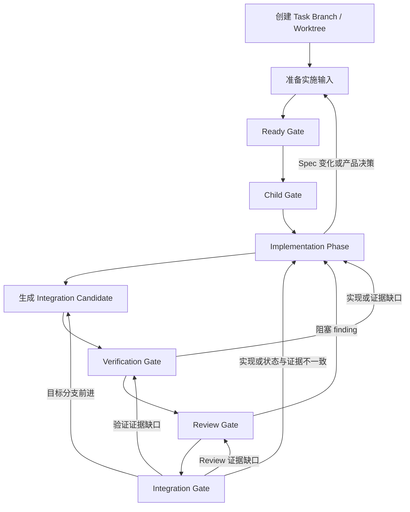

# WORKFLOW

> 用户明确要求按 `docs/specs/<规格文件>.md` 实现并提交代码时，协调员使用 `execute-spec-workflow` Skill 推进本流程。本文件只定义仓库稳定合同；阶段执行细节由该 Skill 及其 references 承载。

## 1. 角色与权威

| 角色   | 运行身份                | 职责                                                             |
| ------ | ----------------------- | ---------------------------------------------------------------- |
| 协调员 | 宿主 Agent              | 准备、编排、等待、Review 协调、Gate 放行和最终集成               |
| 实施者 | implementation terminal | 实现、修复、验证、提交和任务账本证据回写                         |
| 审查者 | reviewer terminal       | 独立审查实现，报告 finding 和审查结论，并跟踪 finding 至明确关闭 |

- 协调员创建和管理 Review Task 与只读 reviewer terminal。
- 实施者把阶段结果、未知项和停止原因报告协调员。
- 审查者把 finding 和审查结论报告协调员。
- 协调员检查 Review 上下文、revision 和 finding 是否可定位。
- 协调员把可定位的阻塞 finding 派发给实施者。
- 协调员不直接实现、修复代码或代替审查者作出审查结论。
- 同一 finding 及其修复影响由同一审查者跟踪至关闭。只有独立新问题才建立新的 Review 上下文。
- 当前 Spec 是产品行为和验收的权威来源；对应 `docs/execution/*.tasks.json` 是实施任务身份、依赖、状态和证据的权威来源。
- `execute-spec-workflow` Skill 负责状态检测和阶段路由。

## 2. 稳定协作身份

| 身份                    | 合同                                                                        |
| ----------------------- | --------------------------------------------------------------------------- |
| task worktree           | 从首次任务专属 Spec 或账本写入前开始，承载本任务完整生命周期的唯一 worktree |
| task branch             | 从目标分支创建且实施期间不跟随目标分支的持久 Git 身份                       |
| implementation terminal | Child Gate 后任务文件的唯一写入者；协调员只执行 Git 集成操作                |
| integration candidate   | 实施完成后由协调员根据当前目标分支生成的当前验证、Review 与集成候选         |
| Review Task             | 当前 Review 上下文；同一 finding 的修复和复审保持在该上下文                 |
| reviewer terminal       | Review Task 的只读审查者；独立新问题才使用新的 reviewer terminal            |

Git revision 只用于运行时确认审查者检查的实现内容与最终集成内容相同，不作为 WORKFLOW 标识或任务账本结构化字段。

- 协调员在首次写入本任务专属 Spec、任务账本或其他实施输入前，从目标分支创建 task branch，并在唯一 task worktree 中检出该分支。
- task branch 创建后，目标分支的推进不触发同步或 rebase。Spec、任务账本、实现和实施者验证均在 task branch 上完成。
- 实施完成后，协调员才检查目标分支，并通过 Git 祖先关系决定直接采用 task branch，或从 task branch 创建独立 integration candidate。
- 禁止为同步目标分支而改写 task branch。

## 3. Spike 边界

- 实施过程中出现未知项时，实施者只报告未知项及影响面，不自行创建或执行 Spike，也不修改 Spec 或 ADR。
- 只有协调员明确 dispatch 才执行 Spike；协调员决定进入 Spike 时，按 `create-spike` Skill 创建和执行。
- 一个 Spike 只回答一个有界决策问题，结论为 GO/NO-GO/INCONCLUSIVE；决策问题变化时新建 Spike 文档，不在旧文档追加。
- Spike 结论为 GO 时继续当前实施；NO-GO、INCONCLUSIVE 或需要产品决定时返回准备阶段，停止当前 dispatch。

## 4. Gate 合同

| Gate         | 进入条件                       | 放行条件                                                                                                       |
| ------------ | ------------------------------ | -------------------------------------------------------------------------------------------------------------- |
| Ready        | task branch 与 worktree 已建立 | 任务账本与 Spec 一致；实施输入已提交到 task branch；`check --ready` 已通过一次                                 |
| Child        | Ready Gate 通过                | task branch、worktree 和 implementation terminal 唯一；worktree clean；写入权已交给实施者                      |
| Verification | integration candidate 已确定   | 实施者先验证最终候选，协调员随后独立验证；双方均通过；委派证据已回写；外部资源已归类                           |
| Review       | Verification Gate 通过         | integration candidate 在 Review 期间已冻结；所有阻塞 finding 已由对应审查者关闭                                |
| Integration  | Review Gate 通过               | 目标分支仍是被审候选的祖先；证据语义核对通过；`check --final` 通过；候选已 fast-forward 集成；非预期资源已清理 |

Gate 只包括 Ready、Child、Verification、Review 和 Integration。Implementation 是 Child 与 Verification 之间的阶段，不是 Gate；其完成条件为：全部可执行 IMP 已提交到 task branch，实施者已完成验证并取得相关证据，或已到达 decision boundary 并报告。

- 一个 dispatch 连续处理所有可执行 IMP，直到遇到产品决策、Spec 变化、需协调员执行的外部验证、阻塞 finding 或其他明确 decision boundary；禁止为每个 IMP 单独派发。
- 协调员只在实施者完成 task branch 的实现和验证后检查目标分支并确定 integration candidate。候选相对 task branch 发生变化时，实施者必须先验证该候选。
- Verification Gate 只有在实施者先验证最终 integration candidate、协调员随后独立验证，且双方均通过后才放行；双方通过前不得进入 Review。
- 任一 Gate 未通过时停在当前阶段，或返回表中能够解除缺口的前序阶段。禁止跨过 Gate、跳过有效测试、伪造证据或把未运行验证报告为通过。
- Review 期间禁止修改 integration candidate。
- 审查者接受后，只允许实施者提交对应任务账本的 Review 结论和状态；integration candidate 的其他文件变化会使 Review Gate 失效。
- 目标分支前进会使 Integration Gate 失效。协调员从上一版 integration candidate 派生新候选并同步当前目标分支；实施者和协调员依次验证后，由同一审查者复审。
- Integration Gate 的“证据语义核对”指协调员逐项确认 `evidence.checks` 与 `evidence.reviews` 相关、当前、可定位，且 IMP 状态与证据一致；`check --final` 只校验账本 schema、Spec 摘要、覆盖、依赖、状态和证据字段非空，不判断证据内容是否真实或相关。

## 5. 交付前检查

- [ ] task branch 是否在首次任务专属写入前从目标分支创建，且实施期间没有因目标分支推进而同步或 rebase？
- [ ] task worktree、integration candidate、implementation terminal 和 Review 上下文是否唯一且可定位？
- [ ] Ready、Child、Verification、Review 和 Integration Gate 是否均有当前证据？
- [ ] Implementation 阶段是否完成全部可执行 IMP，并取得相关检查和证据？
- [ ] 任务账本是否与当前 Spec 一致，并真实记录 IMP 状态、依赖和证据？
- [ ] 所有必需验证是否在最后一次相关修改后通过？
- [ ] 所有阻塞 finding 是否已由对应审查者明确关闭？
- [ ] 证据是否逐项核对为相关、当前、可定位，且状态与证据一致？
- [ ] 未知项是否已报告协调员并明确路由（继续 / Spike / 产品决策），且没有未经授权的 Spike、Spec 或 ADR 修改？
- [ ] 主工作区、task worktree 和 integration worktree 是否没有非预期残留？
- [ ] 任务完成前是否已完成自审？
- [ ] 未验证项和剩余风险是否已明确记录？

## 6. 最终报告

报告 task worktree、task branch、integration candidate、implementation terminal 和 Review 上下文，列出 `IMP → BEH/VER → evidence` 映射、各 Gate（Ready、Child、Verification、Review、Integration）证据、Code Review 结论、Integration Gate 证据核对结论、Spike 或产品决策结果（如有）、外部资源收口、fast-forward 集成结果、未验证项和剩余风险。
