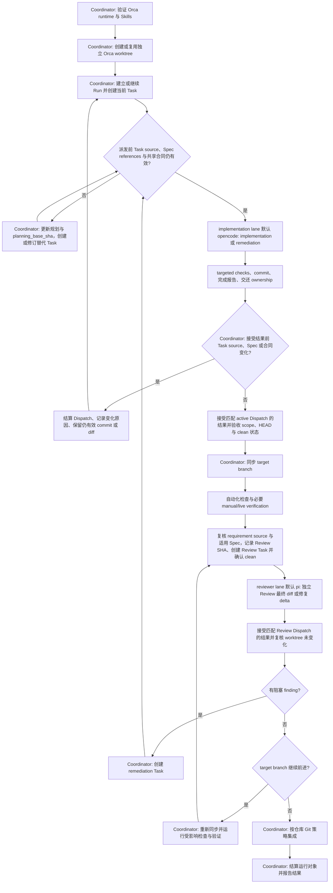

# WORKFLOW

本文件是仓库唯一的开发流程合同：以 Orca Workspace、`orca-cli` 与 Orca Orchestrator 为核心的标准流程。标准和高风险变更必须按第 3 至 8 节执行；低风险小型变更按第 4 节简化，但不得省略 Start 与 Merge 条件。Orca 操作命令以本机 `orca-cli` 与 `orchestration` Skill 为准，本文件不复制其手册。

## 1. 角色与权威边界

- **Coordinator**：local parent session。使用 Orca Orchestrator 建立并监督 Run、Task 与 Dispatch，维护 writer ownership，接收 worker 结果，处理 Spec 变化，执行 target branch 同步、最终验证、Review 调度、集成与报告。Context compact 或接手后，先读本地 checkpoint，再以 Orca runtime、Git、requirement source 和适用 Spec 校准。
- **Implementation writer**：Orca supervised worker，默认 Agent 为 `opencode`；承担 implementation 和 remediation，只写入 Task 声明的 write scope。
- **Independent reviewer**：Orca supervised worker，默认 Agent 为 `pi`；Review 指定 SHA 区间并返回 findings，不修改文件或 Git 历史。
- **Orca Orchestrator**：为 Coordinator 提供 Run、Task、Dispatch、Message 和可选 decision gate 的运行时生命周期及任务状态。其 decision gate 只用于运行时阻塞问题，不是仓库级第三个放行 Gate。

Implementation 和 Review 是被调度的 worker lane，无需另行启动固定的 Coordinator worker。默认 Agent 不可用或有明确不适配原因时，选择其他已配置 Agent，保持相同角色合同，并在最终报告中记录实际 Agent 与原因。

## 2. 权威来源与 runtime 边界

- Requirement source 定义当前任务目标。
- 适用 Spec（`docs/specs/*.md`）是产品行为、约束和验收条件的权威来源。
- Git branch、commit 和最终 diff 是实现状态的权威来源。
- 自动化检查和 Task 要求的 manual/live verification 证明行为；标准和高风险变更使用独立 Review。
- Orca runtime 运行信息只存在于 runtime，不提交为仓库任务账本。
- 长期仓库资产只包括正常工程内容；当前执行状态留在 Orca runtime，必要的恢复摘要只写入 Git-ignored 的 worktree 本地文件（第 9 节）。

## 3. Worktree 与 writer ownership

- Orca-managed worktree 是开发工作的隔离边界；`orca-cli` 管理 worktree、terminal 和轻量进度 checkpoint。
- 同一文件或共享状态范围同时只有一个 writer；只读调查可并行。
- 实施在独立 task worktree 上进行，不在用户主工作区直接实施。
- Coordinator 仅在相关 writer 已交还 ownership 且不存在重叠 writer 时，处理机械冲突、集成胶水或小型修复。
- 低风险路径没有派发 implementation worker 时，Coordinator 必须先显式取得该 Task 的 write ownership；其产生的任何修改都必须提交、复验，并纳入适用的 Review 范围。

## 4. Orca Task 与风险分级

- 每个 Orca Task 必须明确 requirement source，例如 handoff、issue、ADR 或产品 Spec。
- 只有受产品 Spec 管辖的 Task 才使用带文件路径的 `spec_refs`（如 `docs/specs/<file>.md#BEH-001`）；非产品行为 Task 保持 `spec_refs` 为空，不得为追踪方便伪造 `BEH-*` 或 `VER-*`。`BEH-*` 与 `VER-*` 只在所属 Spec 内定位，不是仓库全局裸 ID。
- Implementation Task spec 至少包含：`role`、`objective`、`planning_base_sha`、`source_refs`、`spec_refs`、`acceptance`、`write_scope`、`depends_on` 与 `required_checks`。Review Task 使用 `role: review`，引用 `review_base_sha`、`reviewed_head_sha` 和要检查的验收条件。
- 这些字段属于 Orca Task spec，不写入仓库账本，也不复制到 checkpoint 形成第二套任务图。`objective` 与 `acceptance` 是当前 Task 的语义快照；`planning_base_sha` 只锚定 Git 已跟踪内容；requirement source 未被 Git 跟踪时，直接比较当前 source 内容与该语义快照。
- 风险分级：标准和高风险变更走完整 implementation + Review 路径；明确的低风险小型变更可由单一 Agent 完成，省略 dispatched writer 或 independent reviewer，但不得省略 Start 与 Merge 条件，也不得跳过适用的验证要求。

## 5. Spec 增量处理

派发 implementation 或 remediation 前，以及接受对应 active Dispatch 的 worker 结果前，比较 Task 的 `planning_base_sha`、`source_refs`、适用 `spec_refs`、共享合同与当前内容。处理规则：

- 没有语义变化，或只有拼写、排版和说明优化：继续当前任务。
- 变化与当前 source/spec references、共享合同和依赖闭包无关：当前任务继续，为新变化建立独立 Task。
- 变化影响当前目标、行为、公共契约、权限、状态模型或验证规则：结算受影响 Dispatch，使用 Orca 支持的 Task status/result 记录原因；产品 Spec 变化可记录 `spec_changed`，再创建替代 Task。
- 仍符合新版 requirement/Spec 的现有 commit 或 diff 可作为替代 Task 输入，不机械推倒重做。

Coordinator 只接受同时满足以下条件的完成结果：`taskId` 对应当前 Task；`dispatchId` 对应该 Task 的 current active Dispatch；报告的 final SHA 可定位；修改文件属于声明的 write scope（或越界原因已被 Coordinator 接受）；writer 已交还相关 ownership。

## 6. 实现、提交、同步与验证

1. Coordinator 在独立 worktree 完成 inventory，通过 Orchestrator 建立 Run 和 implementation Task，并记录 target branch、target SHA、`planning_base_sha`、requirement source、适用 Spec references、write scope 与验收条件。
2. 派发前按第 5 节校验；仍有效时按本机 Skill 派发默认 `opencode` writer；已变化时先更新规划和替代 Task。
3. Implementation writer 在声明的 write scope 内实施，运行 targeted checks，把改动提交到 task branch，通过当前 Dispatch 的完成消息报告 `taskId`、`dispatchId`、final SHA、修改文件、检查结果和剩余问题，同时交还 write ownership。允许多个有意义的 commit，不强制 squash。
4. Coordinator 在接受结果前再次按第 5 节比较，并读取 Orca Task/Dispatch、Git HEAD 与 worktree 状态；只接受匹配 current active Dispatch 的结果，确认 commit 属于声明 scope、final SHA 可定位、没有重叠 writer，且 worktree clean。
5. Coordinator 同步当前 target branch。机械且可控的冲突可在没有重叠 writer 时直接解决；超出该边界的冲突建立 remediation Task，交给 implementation lane。该 Task 同样遵循本节的 source/Spec、scope、commit、完成报告与 ownership 合同。冲突处理完成后提交并再次确认 clean。
6. Coordinator 将同步所用的 target SHA 记录为 `REVIEW_BASE_SHA`，然后在同步后的 HEAD 运行 `pnpm check` 和 `git diff --check "$REVIEW_BASE_SHA"...HEAD`，并执行 Task、Spec 或风险分级要求的 manual/live verification。所有结果绑定当前 HEAD；无法执行的项目记录具体原因和剩余风险。

## 7. 独立 Review 与 finding 修复

1. 派发 Review 前重新读取 requirement source 与适用 Spec；发生相关语义变化时按第 5 节重规划。
2. 将 Review Task 的 `review_base_sha` 设为 `REVIEW_BASE_SHA`，把当前 HEAD 记录为 `reviewed_head_sha`，确认 `HEAD == reviewed_head_sha` 且 `git status --porcelain=v1` 为空。
3. 创建 Review Task 并派发 reviewer lane（默认 `pi`）。默认让 reviewer 读取当前 task worktree 的 `reviewed_head_sha`，不授予 write ownership；若采用独立 review worktree，先确认其 `review_base_sha` 与 `reviewed_head_sha` 和待审分支一致。任务合同至少包含：Review 指定 SHA 区间；不修改文件、不提交；优先检查正确性、回归、缺失检查、流程合同违规与 Orca runtime 状态意外持久化；按严重程度报告带 file/line 的 findings；明确声明是否仍有阻塞 finding。
4. 只接受与 Review Task current active Dispatch 匹配的完成结果；接受后再次确认 `HEAD == reviewed_head_sha` 且 worktree clean。此处验证 reviewer 的任务合同，不把 prompt 约束描述成文件系统权限。
5. 自动化检查、`git diff --check` 与必要 manual/live verification 绑定 `reviewed_head_sha`；Reviewer 核对该关系，有具体风险时可运行 targeted check，不强制重复完整套件。
6. 有阻塞 finding：结算 Review Dispatch，创建 remediation Task，在重新授予单一 writer ownership 后派发 implementation lane。Remediation 遵循第 6 节的 requirement/Spec、scope、commit、完成报告与 ownership 合同；接受结果后重跑受影响检查和最终 `pnpm check`，按需重做 manual/live verification，更新 `reviewed_head_sha`，再由原 reviewer lane Review delta 与受影响上下文。原 reviewer 不可用时，按同一合同选择替代 reviewer 并记录原因。

## 8. Target branch 前进与集成

- Review 接受后重新读取 target SHA：未前进时可以集成；已前进时重新同步并运行受影响检查，同步影响被测范围时重跑 `pnpm check` 与对应 manual/live verification，更新 `REVIEW_BASE_SHA` 与 `reviewed_head_sha`，回到第 7 节。
- 同步产生冲突解决、最终 diff 变化或共享行为变化时，reviewer 扩大到受影响上下文；否则只做同步 delta 的轻量确认，不强制重复完整 Review。
- Coordinator 按仓库 Git 策略集成，通过 Orchestrator 结算 Run、Task 与 Dispatch，并清理不再需要的 terminal 和 worktree。

## 9. Checkpoint 与清理

- 优先用 Orca worktree comment 保存一行进度；需要更多恢复上下文时，在当前 worktree 使用 `.orca-tmp/session-handoff.md`（该目录已被根 `.gitignore` 忽略）。规则落地前只使用 worktree comment。
- checkpoint 只保存恢复摘要：Objective；Worktree/branch/target；Last stable HEAD；Review base SHA / reviewed HEAD；Requirement source / 适用 Spec；Run / active Task / Dispatch；Current write owner and scope；Decisions and constraints；Last completed action；Next action；Blockers / unverified items。
- 不保存 runtime task graph、自定义任务状态、逐任务 evidence 或 finding 状态表；checkpoint 不是 Task ledger 镜像。与现场冲突时，以 Orca runtime、Git、requirement source 和适用 Spec 为准。child worktree 不继承父 worktree 的 ignored 文件，跨 worktree 上下文通过 Orca Task spec 或消息传递。
- 只在 context compact 前、ownership 交接前、关键决策、阻塞或重规划时，以及恢复并完成现场校准后更新。恢复顺序：读取 handoff 与当前 worktree checkpoint → 读取 Git 与 Orca runtime → 读取 requirement source 与适用 Spec → 修正过期摘要 → 从 Next action 继续。
- 任务结束且不再需要恢复后，删除 `.orca-tmp/session-handoff.md`；`git clean -fdX` 前确认不再需要 checkpoint。

## 10. 最终报告

只列出可证明内容：Orca worktree、branch、initial target SHA、final review base SHA、最终 commit；实际 Agent 及覆盖原因；Run、Task 与 Dispatch 的结算状态；删除与修改文件；检查及对应 HEAD；Review 结论和已修复 finding；现有功能 worktree 状态；未验证项和剩余风险。

## 11. Start 条件

- [ ] Coordinator 已确认目标、范围和验收条件清楚，并承担本次 Run 的监督责任。
- [ ] target branch、target SHA、worktree 和 task branch 可定位。
- [ ] worktree clean，或已有修改的负责人和用途已明确。
- [ ] Task 的 requirement source、适用 Spec references、write scope、required checks 和 dependencies 已明确。
- [ ] 没有两个 writer 修改同一文件或共享状态范围。
- [ ] 高风险变化已识别必要的 Spec、manual/live verification 和 Review。

## 12. Merge 条件

- [ ] 所有待 Review 改动已提交，worktree clean。
- [ ] task branch 已同步 Review 所依据的 target SHA；Review 后的 target branch 前进已按第 8 节处理。
- [ ] Coordinator 在最终相关修改后运行的自动化检查通过，结果绑定最终 HEAD。
- [ ] 当前 requirement source 与适用 Spec 仍支持最终实现和验收条件。
- [ ] 必需的 manual/live verification 已完成，或未验证原因已记录。
- [ ] 任务要求的独立 Review 已完成，结论绑定最终 HEAD，阻塞 finding 已关闭。
- [ ] 最终 diff、未验证项和剩余风险已检查并报告。

完成条件：Start 与 Merge 条件全部满足后，由 Coordinator 按第 8 节集成并报告。
